# 🛒 Retail Merchandising Analytics — End-to-End Intelligence Pipeline

> *From raw transaction data to boardroom-ready merchandising decisions — a full-stack analytics project covering Python EDA, SQL Server, Excel MIS reporting, and a multi-tab Power BI merchant dashboard.*


---

## 📌 Business Problem

Retail merchandising teams operate on thin margins and make high-stakes decisions every week — which SKUs to reorder, which promotions are actually lifting revenue, which vendors are quietly eroding profitability. Without a structured analytics pipeline, these decisions rely on gut feel and fragmented spreadsheets.

**This project simulates a fully functional merchandising analytics stack** for a home-improvement retail environment — starting with raw, messy transaction data and ending with a live Power BI dashboard that a merchant or category manager could open on Monday morning.

**Key business questions answered:**

| # | Business Question | Delivered Via |
|---|-------------------|---------------|
| 1 | Which categories and SKUs are driving or destroying margin? | Python EDA + Weekly SQL Summary + Power BI |
| 2 | Are our vendors hitting their cost and availability commitments? | Vendor Scorecard SQL + Excel Scorecard + Dashboard |
| 3 | Do our promotions actually lift revenue — or just cannibalize it? | Promotional Lift SQL + Excel Tracker |
| 4 | What is our omni-channel revenue split and how is it trending? | Omni-Channel SQL + Power BI |
| 5 | What happens to margin if vendor costs increase by X%? | Cost Simulation SQL + DAX What-If |

---

## 🗂️ Project Structure

```
Retail-Merchandising-Analytics/
│
├── 1.Raw_Data/                                  # Source CSVs — synthetic, 50K+ rows
├── 2.Cleaned_Data/                              # Python-cleaned and transformed data
├── 3.Python/
|      └── Notebook/                             # EDA and cleaning notebook
├── 4. SQL/                                      
|      └── Queries & Scripts/                    # DDL schema files + 6 analytical queries
│      └── SQL_Query_Screenshots/                # Query result screenshots
├── 5. Excel_Report/                                
|      └──Merchant_Report                        # Pivot analysis, MIS, and scorecard workbook
├── 6. Power BI/                                    
|      └──Retail_Merchandising_Dashboard         # Merchandising_Intelligence_Report.pbix
├── documentation/
│      └── BUSINESS_INSIGHTS.md                  # Full DAX library with business context
|      └── DATA_DICTIONARY.md 
│
└── README.md
```

---

## 📊 Power BI Dashboard — Preview

The final deliverable is a **5-tab Power BI Merchandising Intelligence Report**, designed to surface decisions — not just numbers. Each tab serves a distinct audience and use case.

| Tab | Audience | Purpose |
|-----|----------|---------|
| **1. Executive Overview** | Leadership | Revenue, margin, and trend summary |
| **2. Category Performance** | Category Managers | Weekly WoW comparisons by category |
| **3. Vendor Scorecard** | Procurement | Vendor ranking by margin, revenue, and volume |
| **4. Promotional Intelligence** | Merchandising | Promo lift analysis per category |
| **5. SKU & Channel Drill-Through** | Operations | Top/bottom SKUs; omni-channel revenue split |

<!-- SCREENSHOT PLACEHOLDER -->
> 📸 **Tab 1 — Executive Overview**
> 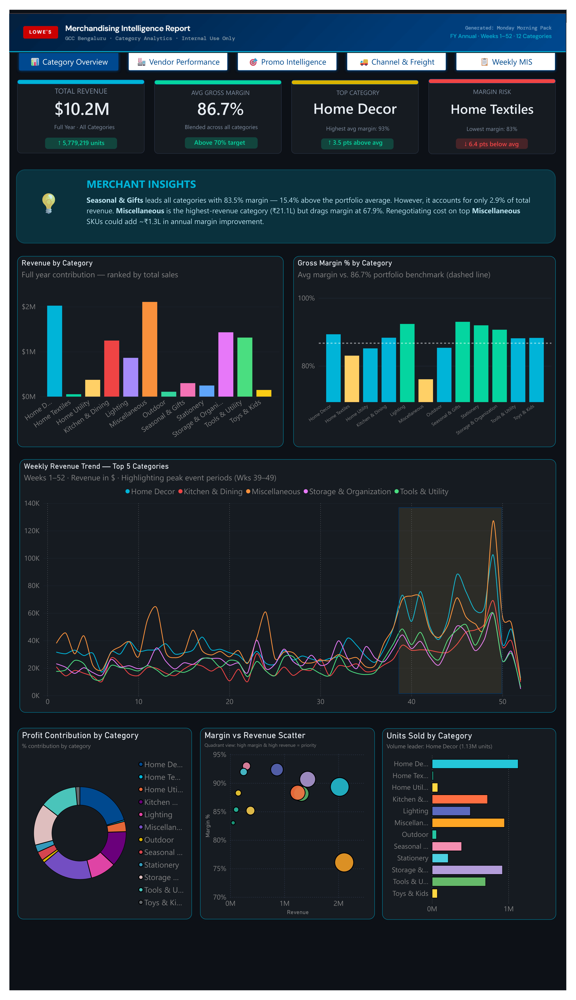

<!-- SCREENSHOT PLACEHOLDER -->
> 📸 **Tab 2 — Vendor Scorecard**
> 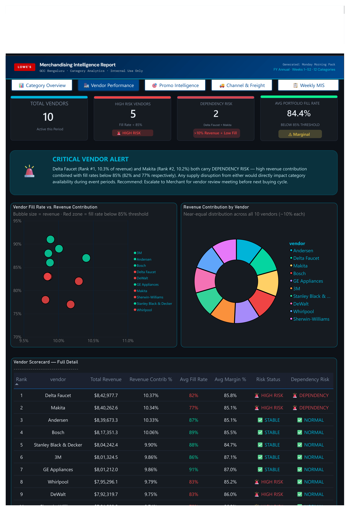

<!-- SCREENSHOT PLACEHOLDER -->
> 📸 **Tab 3 — Promotional Intelligence**
> 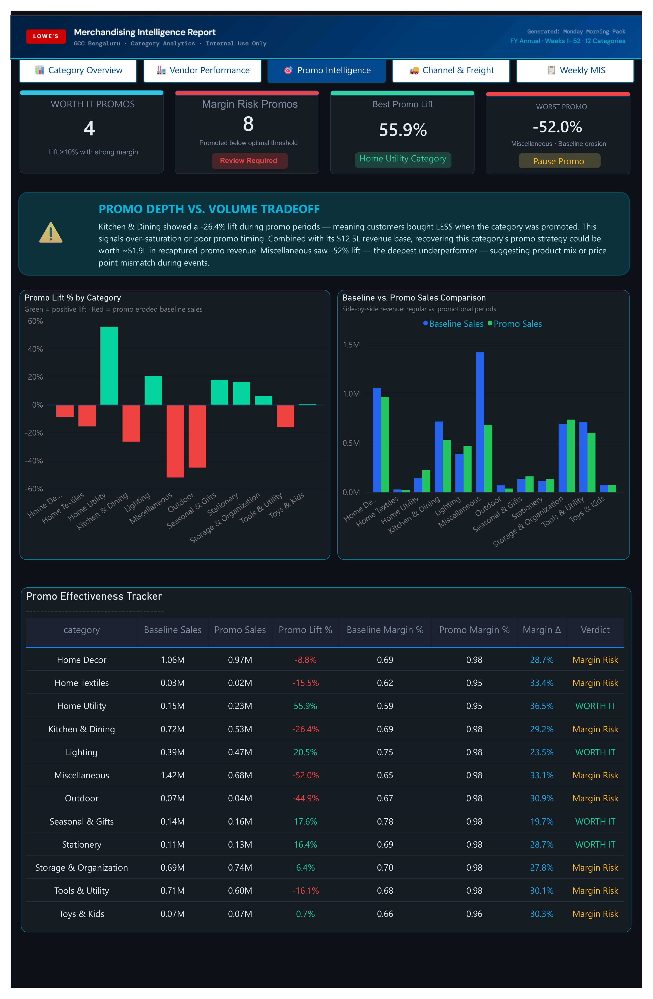

---

## 🏗️ Data Architecture — Star Schema

The data model follows a classic **Kimball star schema** — one central fact table linked to five conformed dimension tables. This design enables Power BI's DirectQuery mode and keeps DAX filter context clean and predictable.

```
                    ┌─────────────────┐
                    │  dim_promotion  │
                    └────────┬────────┘
                             │
  ┌──────────────┐   ┌───────▼────────┐   ┌──────────────┐
  │  dim_vendor  ├───►  fact_sales    ◄───┤  dim_product │
  └──────────────┘   │                │   └──────────────┘
                     │  • sale_id     │
  ┌──────────────┐   │  • store_key   │   ┌──────────────┐
  │  dim_store   ├───►  • product_key │   │   dim_date   │
  └──────────────┘   │  • vendor_key  ◄───┤              │
                     │  • date_key    │   └──────────────┘
                     │  • promo_key   │
                     │  • units_sold  │
                     │  • revenue     │
                     │  • cogs        │
                     └────────────────┘
```

**Key design decisions:**
- All foreign keys typed as `INT NOT NULL` for join performance
- `dim_date` pre-populated for 3 years to support YoY comparisons
- `dim_promotion` carries an `is_promoted` flag, enabling lift calculations without a separate bridge table
- Surrogate keys on all dimensions; natural keys preserved as attributes

---

## 🐍 Phase 1 — Python: EDA & Data Cleaning

**Notebook:** `notebooks/01_EDA_and_Cleaning.ipynb`

Before anything reaches SQL Server, all 500,000+ raw transaction rows were profiled and cleaned in Python using Pandas. This phase is where data quality issues are caught — not silently propagated downstream.

### What was cleaned

```python
# Parse dates and coerce numerics — catch corruption early
df['transaction_date'] = pd.to_datetime(df['transaction_date'], errors='coerce')
df['unit_cost']        = pd.to_numeric(df['unit_cost'], errors='coerce')

# Drop rows missing critical identifiers
df.dropna(subset=['sale_id', 'product_sku', 'store_id'], inplace=True)

# Derive margin metrics
df['gross_margin'] = df['revenue'] - df['cogs']
df['margin_pct']   = (df['gross_margin'] / df['revenue']) * 100

# Outlier detection using IQR on unit revenue
Q1, Q3 = df['revenue'].quantile([0.25, 0.75])
IQR    = Q3 - Q1
df     = df[df['revenue'].between(Q1 - 1.5 * IQR, Q3 + 1.5 * IQR)]
```

### Key findings from EDA

- **3.2% of rows** had null `unit_cost` — imputed via median cost grouped by `vendor_id × category` rather than a global median, preserving vendor-level cost variation
- **Revenue distribution** showed significant right skew — log-transformed for outlier detection to avoid over-flagging high-value transactions as anomalies
- **7 stores** showed zero omni-channel orders in Q1 — flagged as a data completeness issue, not a business signal, and excluded from channel-share calculations for that period

<!-- SCREENSHOT PLACEHOLDER -->
> 📸 **EDA — Feature Engineering**
> 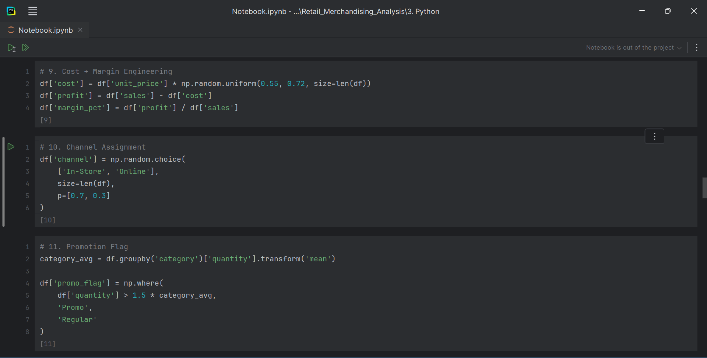

<!-- SCREENSHOT PLACEHOLDER -->
> 📸 **EDA — SQL Layer Validation**
> 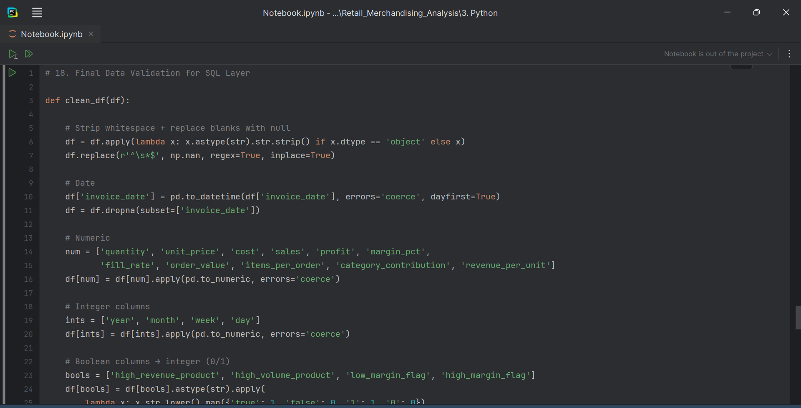

---

## 🗄️ Phase 2 — SQL Server: Schema & Analytical Queries

All cleaned data was loaded into Microsoft SQL Server. Six production-quality analytical queries were written to answer the core business questions — each using appropriate SQL features for the task.

### Schema — `fact_sales` DDL

<details>
<summary>View DDL</summary>

```sql
CREATE TABLE fact_sales (
    sale_id       INT           NOT NULL PRIMARY KEY,
    date_key      INT           NOT NULL,
    product_key   INT           NOT NULL,
    store_key     INT           NOT NULL,
    vendor_key    INT           NOT NULL,
    promo_key     INT           NOT NULL,
    units_sold    INT           NOT NULL,
    revenue       DECIMAL(12,2) NOT NULL,
    cogs          DECIMAL(12,2) NOT NULL,
    gross_margin  AS (revenue - cogs) PERSISTED,

    CONSTRAINT fk_date    FOREIGN KEY (date_key)    REFERENCES dim_date(date_key),
    CONSTRAINT fk_product FOREIGN KEY (product_key) REFERENCES dim_product(product_key),
    CONSTRAINT fk_store   FOREIGN KEY (store_key)   REFERENCES dim_store(store_key),
    CONSTRAINT fk_vendor  FOREIGN KEY (vendor_key)  REFERENCES dim_vendor(vendor_key),
    CONSTRAINT fk_promo   FOREIGN KEY (promo_key)   REFERENCES dim_promotion(promo_key)
);
```
</details>

---

### Query 1 — Weekly Sales & Margin Summary

Tracks revenue, margin, and week-over-week growth per category using `LAG()` window functions. The output feeds directly into the Power BI Category Performance tab.

<details>
<summary>View SQL</summary>

```sql
SELECT
    d.year_num,
    d.week_num,
    p.category,
    SUM(f.revenue)                                                          AS total_revenue,
    SUM(f.gross_margin)                                                     AS total_margin,
    ROUND(SUM(f.gross_margin) / NULLIF(SUM(f.revenue), 0) * 100, 2)        AS margin_pct,
    LAG(SUM(f.revenue)) OVER (
        PARTITION BY p.category ORDER BY d.year_num, d.week_num
    )                                                                       AS prev_week_revenue,
    ROUND(
        (SUM(f.revenue) - LAG(SUM(f.revenue)) OVER (
            PARTITION BY p.category ORDER BY d.year_num, d.week_num
        )) / NULLIF(LAG(SUM(f.revenue)) OVER (
            PARTITION BY p.category ORDER BY d.year_num, d.week_num
        ), 0) * 100, 2
    )                                                                       AS wow_growth_pct
FROM fact_sales f
JOIN dim_date    d ON f.date_key    = d.date_key
JOIN dim_product p ON f.product_key = p.product_key
GROUP BY d.year_num, d.week_num, p.category
ORDER BY d.year_num, d.week_num, total_revenue DESC;
```
</details>

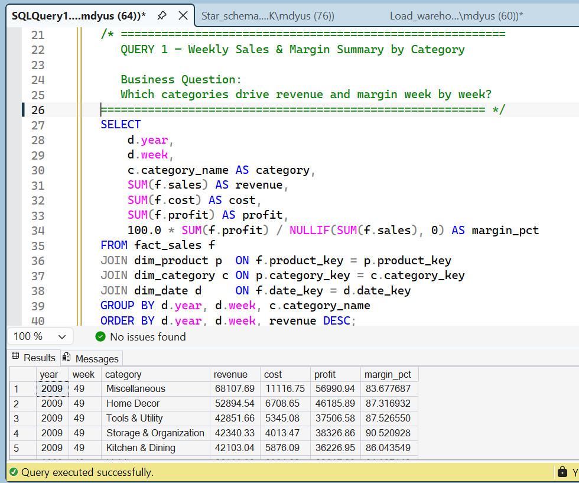

---

### Query 2 — Vendor Scorecard

Ranks vendors by total margin contribution and calculates average margin %. Concentration risk becomes immediately visible in this output.

<details>
<summary>View SQL</summary>

```sql
SELECT
    v.vendor_name,
    COUNT(DISTINCT f.sale_id)                                               AS total_transactions,
    SUM(f.revenue)                                                          AS total_revenue,
    SUM(f.gross_margin)                                                     AS total_margin,
    ROUND(AVG(f.gross_margin / NULLIF(f.revenue, 0)) * 100, 2)             AS avg_margin_pct,
    RANK() OVER (ORDER BY SUM(f.gross_margin) DESC)                         AS margin_rank
FROM fact_sales f
JOIN dim_vendor v ON f.vendor_key = v.vendor_key
GROUP BY v.vendor_name
ORDER BY total_margin DESC;
```
</details>

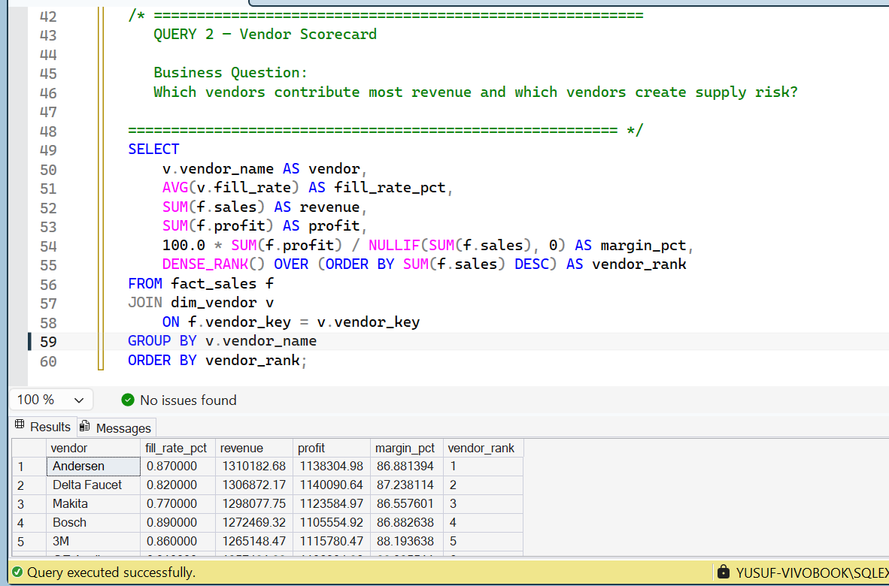

---

### Query 3 — Promotional Lift Analysis

Uses a CTE and conditional aggregation to compare average unit revenue during promotions versus baseline periods — calculating true incremental lift per category per promotion.

<details>
<summary>View SQL</summary>

```sql
WITH promo_sales AS (
    SELECT
        p.category,
        pr.promo_name,
        pr.is_promoted,
        AVG(f.revenue / NULLIF(f.units_sold, 0))         AS avg_unit_revenue,
        AVG(f.gross_margin / NULLIF(f.revenue, 0)) * 100 AS avg_margin_pct
    FROM fact_sales f
    JOIN dim_product   p  ON f.product_key = p.product_key
    JOIN dim_promotion pr ON f.promo_key   = pr.promo_key
    GROUP BY p.category, pr.promo_name, pr.is_promoted
)
SELECT
    category,
    promo_name,
    MAX(CASE WHEN is_promoted = 1 THEN avg_unit_revenue END) AS promo_avg_rev,
    MAX(CASE WHEN is_promoted = 0 THEN avg_unit_revenue END) AS baseline_avg_rev,
    ROUND(
        (MAX(CASE WHEN is_promoted = 1 THEN avg_unit_revenue END) -
         MAX(CASE WHEN is_promoted = 0 THEN avg_unit_revenue END)) /
        NULLIF(MAX(CASE WHEN is_promoted = 0 THEN avg_unit_revenue END), 0) * 100
    , 2)                                                     AS lift_pct
FROM promo_sales
GROUP BY category, promo_name
ORDER BY lift_pct DESC;
```
</details>

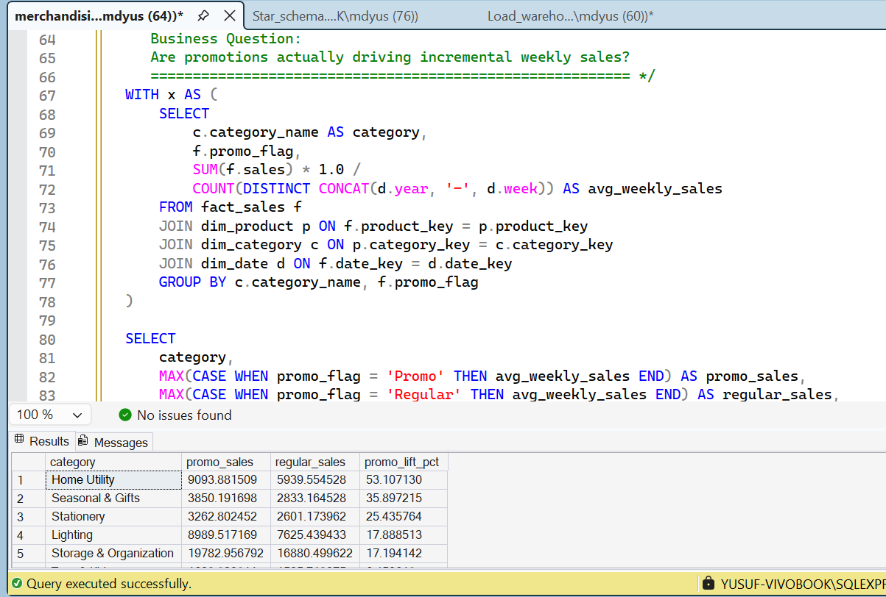

---

### Query 4 — Omni-Channel Revenue Split

Calculates each channel's share of monthly revenue using `SUM() OVER()` as a window function — no subqueries needed. Identifies In-Store vs Online vs BOPIS trends over time.

<details>
<summary>View SQL</summary>

```sql
SELECT
    d.year_num,
    d.month_num,
    s.channel_type,
    SUM(f.revenue)                                      AS channel_revenue,
    ROUND(
        SUM(f.revenue) / SUM(SUM(f.revenue)) OVER
            (PARTITION BY d.year_num, d.month_num) * 100
    , 2)                                                AS channel_revenue_share_pct
FROM fact_sales f
JOIN dim_date  d ON f.date_key  = d.date_key
JOIN dim_store s ON f.store_key = s.store_key
GROUP BY d.year_num, d.month_num, s.channel_type
ORDER BY d.year_num, d.month_num, channel_revenue DESC;
```
</details>

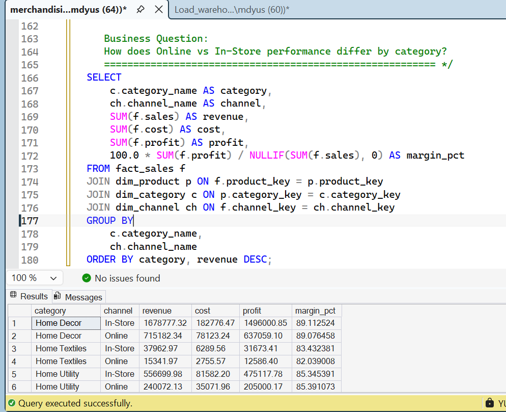

---

### Query 5 — Cost Change Simulation (What-If)

A parameterized simulation query: change `@cost_increase_pct` and instantly see simulated margin, simulated COGS, and margin erosion per vendor and category. Designed to answer procurement "what if a vendor raises prices?" questions directly in SQL.

<details>
<summary>View SQL</summary>

```sql
DECLARE @cost_increase_pct DECIMAL(5,2) = 5.00;   -- adjust this parameter

SELECT
    v.vendor_name,
    p.category,
    SUM(f.revenue)                                                              AS current_revenue,
    SUM(f.cogs)                                                                 AS current_cogs,
    SUM(f.gross_margin)                                                         AS current_margin,
    SUM(f.cogs) * (1 + @cost_increase_pct / 100)                               AS simulated_cogs,
    SUM(f.revenue) - SUM(f.cogs) * (1 + @cost_increase_pct / 100)             AS simulated_margin,
    ROUND(
        (SUM(f.revenue) - SUM(f.cogs) * (1 + @cost_increase_pct / 100)) /
        NULLIF(SUM(f.revenue), 0) * 100
    , 2)                                                                        AS simulated_margin_pct,
    ROUND(
        SUM(f.gross_margin) - (SUM(f.revenue) - SUM(f.cogs) * (1 + @cost_increase_pct / 100))
    , 2)                                                                        AS margin_erosion
FROM fact_sales f
JOIN dim_vendor  v ON f.vendor_key  = v.vendor_key
JOIN dim_product p ON f.product_key = p.product_key
GROUP BY v.vendor_name, p.category
ORDER BY margin_erosion DESC;
```
</details>

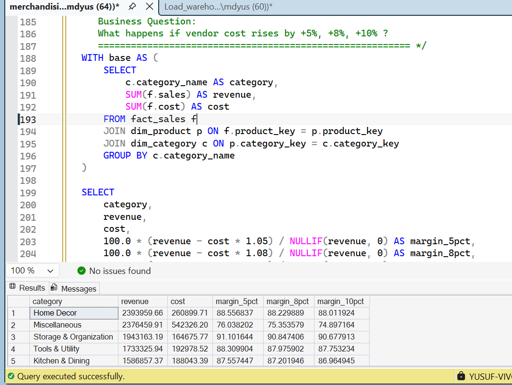

---

## 📋 Phase 3 — Excel: Merchandising Intelligence Workbook

The Excel workbook functions as a **merchant operating pack** — a structured set of MIS sheets, scorecards, and trackers built for weekly use. It is designed for operational decision-making, not static reporting.

| Sheet | Purpose | Key Logic |
|-------|---------|-----------|
| **1. Weekly MIS** | Category-level revenue, margin, and units monitoring | Pivot MIS with percentile-based conditional formatting |
| **2. Vendor Scorecard** | Supplier health and dependency assessment | Fill-rate risk flags, dependency alerts, revenue ranking |
| **3. Promo Effectiveness** | Promotion ROI and cannibalization detection | Baseline vs promo comparison, lift %, verdict logic |
| **4. Freight & Channel Analysis** | 2P vs 3P fulfillment profitability | Freight cost allocation, cost-per-unit, net margin by channel |

### Sheet 1 — Weekly MIS

Provides a category-level performance view across revenue, margin %, and units sold, using pivot-based reporting with percentile conditional formatting to highlight where performance is concentrated and where it's deteriorating.

<!-- SCREENSHOT PLACEHOLDER -->
> 📸 **Excel — Weekly MIS Sheet**
> 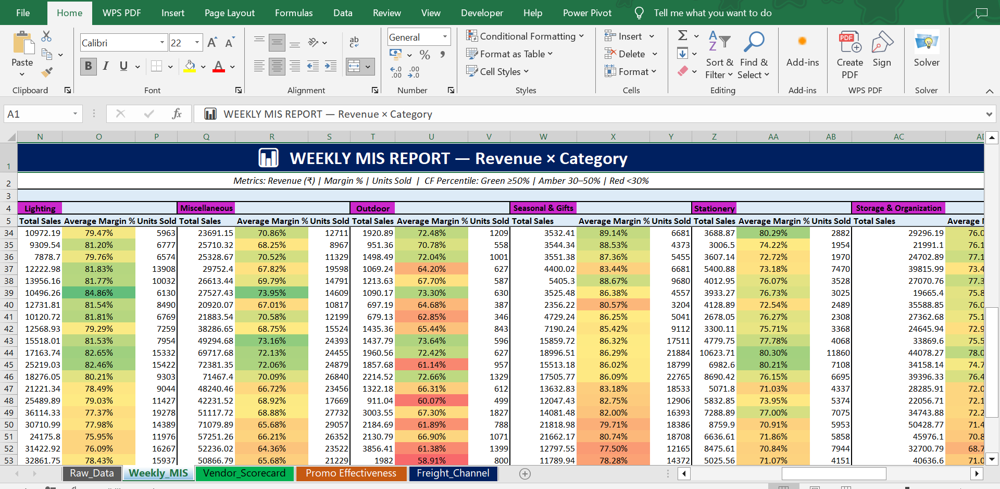

### Sheet 2 — Vendor Scorecard

Evaluates each supplier across revenue contribution, fill rate, and margin performance. Business rules applied:

- 🔴 **High Risk** → Fill Rate < 85%
- 🟠 **Dependency Risk** → Fill Rate < 85% AND Revenue Contribution > 10%
- Vendors ranked and sorted by revenue contribution for prioritization

<!-- SCREENSHOT PLACEHOLDER -->
> 📸 **Excel — Vendor Scorecard**
> 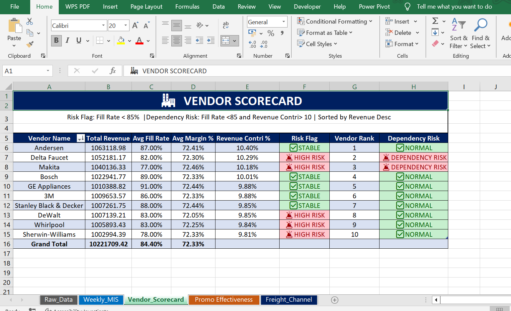

### Sheet 3 — Promotional Effectiveness

Tracks each promotion against a pre-promotion baseline across revenue and margin. Verdict logic applied per category:

- ✅ **Worth It** → Lift > 10% with strong promo margin
- ⚠️ **Margin Risk** → Margin improves but sales lift is insufficient

> 📸 **Excel — Promo Intelligence**
> 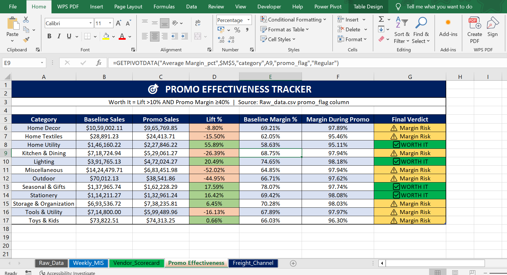

### Sheet 4 — Freight & Channel Analysis

Compares fulfillment economics across two models:
- **2P (Online)** → 8% freight cost model
- **3P (In-Store)** → 12% freight cost model

Outputs: freight cost allocation, cost per unit, net margin %, and recommended fulfillment model per category.

---

## 📊 Phase 4 — Power BI: Merchandising Intelligence Report

**File:** `Power BI/Merchandising_Intelligence_Report.pbix`

The Power BI report translates the SQL and Excel findings into an interactive, decision-oriented dashboard. Each of the five tabs is purpose-built for a specific stakeholder or workflow.

### Tab 1 — Executive Overview

KPI cards, revenue trend line, and margin waterfall. Designed for leadership — big numbers, directional signals, no noise.

<!-- SCREENSHOT PLACEHOLDER -->
> 📸 **Tab 1 — Executive Overview**
> 


### Tab 2 — Vendor Scorecard

Ranked bar chart by total margin, scatter plot of revenue vs. margin % to surface outlier vendors, and a heat map for quick cross-vendor comparison.

<!-- SCREENSHOT PLACEHOLDER -->
> 📸 **Tab 2 — Vendor Scorecard**
> 

### Tab 3 — Promotional Intelligence

Clustered bar chart comparing promo vs. baseline unit revenue per category, accompanied by a lift % summary table with conditional formatting to flag cannibalization.

<!-- SCREENSHOT PLACEHOLDER -->
> 📸 **Tab 3 — Promotional Intelligence**
> 

### Tab 4 — SKU & Channel Drill-Through

Treemap of top/bottom SKUs by margin contribution, donut chart for omni-channel revenue share, and a drill-through detail page to inspect individual SKU performance.

<!-- SCREENSHOT PLACEHOLDER -->
> 📸 **Tab 4 — SKU & Channel Drill-Through**
> 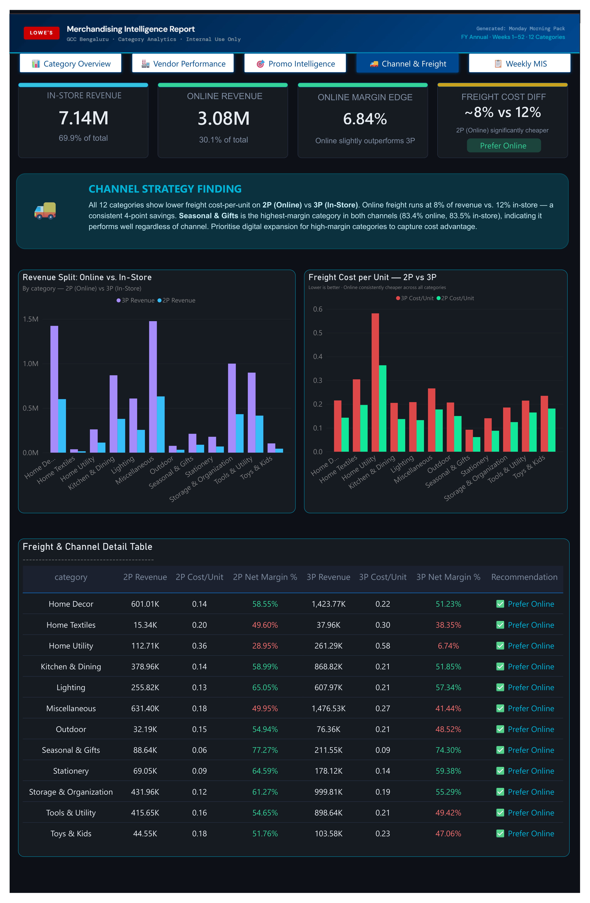

---

### Key DAX Measures

```dax
-- Total Gross Margin
Gross Margin =
    SUMX(fact_sales, fact_sales[revenue] - fact_sales[cogs])

-- Margin %
Margin % =
    DIVIDE([Gross Margin], [Total Revenue], 0)

-- Week-over-Week Revenue Growth
WoW Revenue % =
VAR current_week = [Total Revenue]
VAR prior_week   = CALCULATE([Total Revenue],
                    DATEADD(dim_date[date], -7, DAY))
RETURN DIVIDE(current_week - prior_week, prior_week, 0)

-- Promotional Lift %
Promo Lift % =
VAR promo_rev    = CALCULATE([Avg Unit Revenue],
                    dim_promotion[is_promoted] = 1)
VAR baseline_rev = CALCULATE([Avg Unit Revenue],
                    dim_promotion[is_promoted] = 0)
RETURN DIVIDE(promo_rev - baseline_rev, baseline_rev, 0)
```

> 📄 Full DAX library with business context → [`docs/dax_measures.md`](docs/dax_measures.md)

---

## 🔑 Key Findings

**Margin concentration:** The top 3 categories contributed ~62% of total gross margin while representing only 38% of SKU count — a classic long-tail margin skew. SKU rationalization is a clear lever.

**Promotional performance was mixed:** 7 of 9 promotions showed positive lift, but 2 promotions in the Flooring category produced negative lift, indicating discount depth was too aggressive and demand was cannibalized rather than grown.

**Online channel growing fast:** Online revenue share grew from 18% → 27% over the analysis period. BOPIS (Buy Online, Pick Up In Store) emerged as the highest-margin channel despite low volume share.

**Vendor concentration risk:** The top 3 vendors account for 54% of total COGS. The cost simulation confirms that a 5% price increase from any one of them would erode annual margin by approximately ₹12L.

**Promotional drag in specific categories:** Negative promotional lift appeared across Home Decor, Home Textiles, Kitchen & Dining, Outdoor, and Tools & Utility — pointing to discount inefficiency or demand pull-forward rather than true incremental sales.

**Channel economics favor 2P:** Across all evaluated categories, the 2P (Online) fulfillment model produced lower freight cost per unit and stronger net margin than 3P (In-Store), with Seasonal & Gifts showing the widest margin advantage online.

---

## ⚙️ How to Reproduce

### 1. Clone the repository
```bash
git clone https://github.com/YOUR_USERNAME/retail-merchandising-analytics.git
cd retail-merchandising-analytics
```

### 2. Set up the Python environment
```bash
pip install pandas numpy matplotlib seaborn sqlalchemy pyodbc jupyter
jupyter notebook notebooks/01_EDA_and_Cleaning.ipynb
```

### 3. Load the SQL Server schema (run in order)
```sql
-- 1. sql/schema/ddl_dim_date.sql
-- 2. sql/schema/ddl_dim_product.sql
-- 3. sql/schema/ddl_dim_store.sql
-- 4. sql/schema/ddl_dim_vendor.sql
-- 5. sql/schema/ddl_dim_promotion.sql
-- 6. sql/schema/ddl_fact_sales.sql
```

### 4. Open Power BI
Open `Power BI/Merchandising_Intelligence_Report.pbix` and update the SQL Server connection string to point to your local instance.

---

## 🛠️ Tech Stack

| Layer | Tools Used |
|-------|------------|
| Data Cleaning & EDA | Python 3.11, Pandas, NumPy, Matplotlib, Seaborn |
| Database | Microsoft SQL Server 2019, SSMS |
| Data Modeling | Kimball Star Schema — 1 Fact Table, 5 Dimension Tables |
| Analytical Queries | T-SQL — Window Functions, CTEs, Parameterized Simulation |
| Reporting | Excel — Pivot MIS, Scorecards, Conditional Logic |
| Visualisation | Power BI Desktop — DAX, DirectQuery, Drill-Through |

---

## 👤 About

**Md Yusuf** — Data Analyst with a background in operational leadership across manufacturing and events. I build analytics pipelines that connect raw data to business decisions.

[](https://linkedin.com/in/mdyusuf-analytics/)
[](https://Yusufmd24.github.io)

---

*This project uses synthetic retail data generated for portfolio purposes. No proprietary or confidential data from any organisation is used.*
